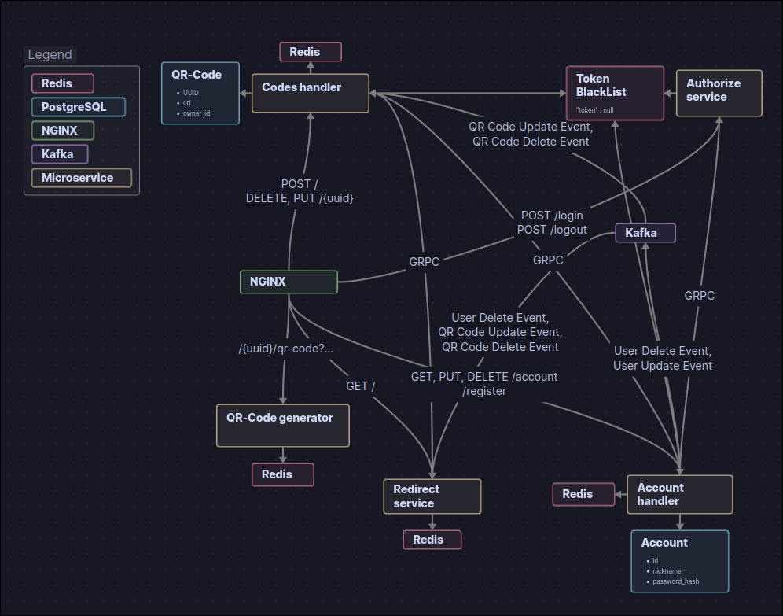
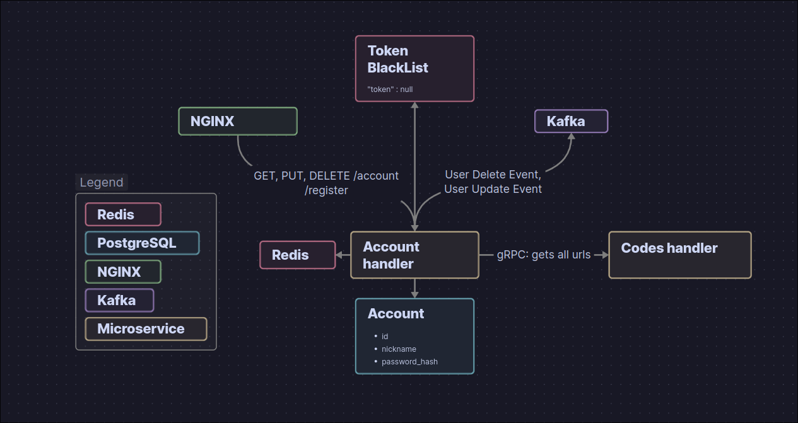
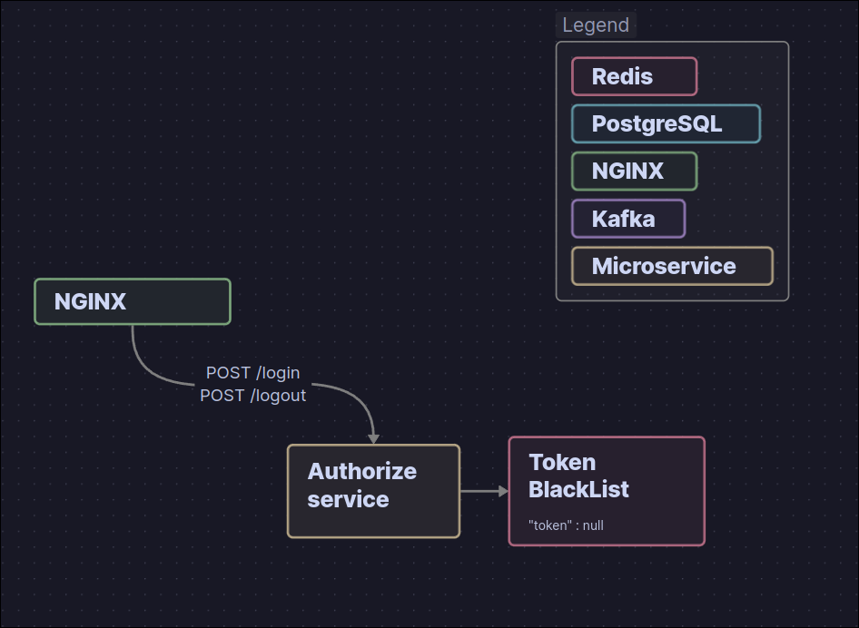
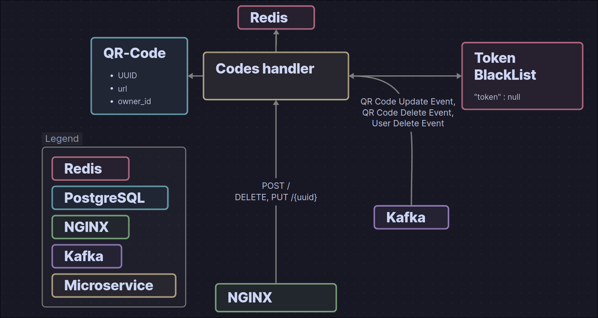
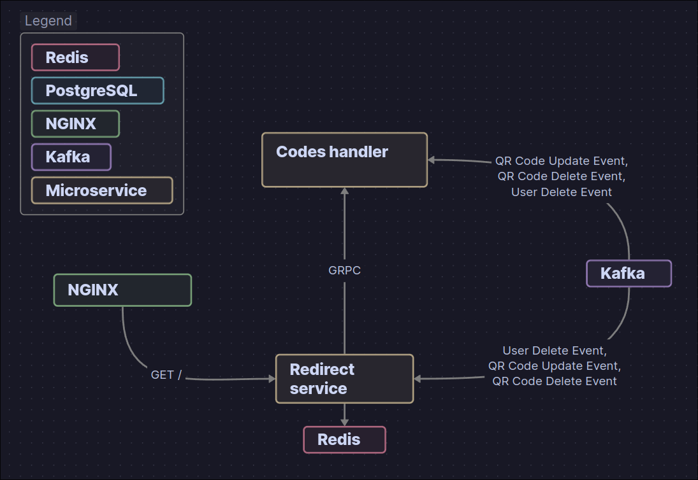
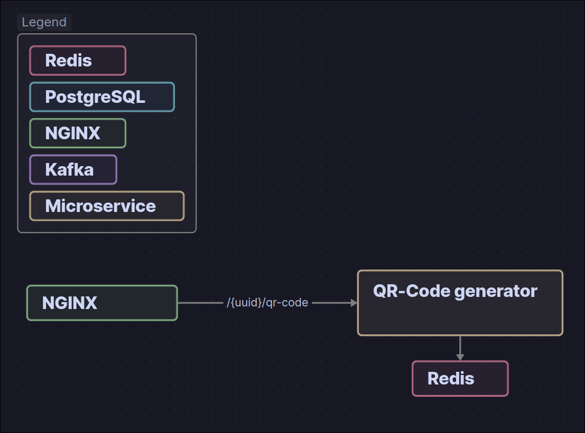

[**Документация также доступна на русском языке!!!**](../README_ru.md)

This is a SaaS application that allows you to share a public link and get a QR code that can be printed without worrying about it becoming outdated — because you can change the destination at any time!

# Microservices

- `auth service` – creates JWT tokens  
- `account service` – manages account data  
- `qr code handler` – manages QR codes  
- `redirect service` – handles user redirection  
- `qr code generator` – generates QR code images  

# API Methods

## `/openapi.yaml`

### GET

Returns the `openapi.yaml` file containing the API documentation.

#### Description

NGINX immediately returns the `openapi.yaml` file when this endpoint is requested.

## `/register`

### POST

Allows a user to register on the platform.

#### Body

```json
{
  "nickname": "string",
  "password": "string"
}
```

#### Description

NGINX forwards the request to the `account service` microservice, which creates a new entry in the database while hashing the user's password.

## `/login`

### POST

Returns a JWT token valid for one hour when account credentials are provided.

#### Body

```json
{
  "password": "string",
  "nickname": "string"
}
```

#### Description

NGINX forwards the request to the `auth service`. The `auth service` makes a gRPC request to the `account service` to retrieve the user data and password hash. It verifies the hash and, upon success, returns a JWT token with a one-hour lifespan.

## `/logout`

### POST

Requires authorization. Adds the JWT token to a blacklist to prevent further use.

#### Description

NGINX forwards the request to the `auth service`, which adds the JWT token to the Redis `jwt black list` with a TTL equal to the token’s lifespan.

## `/account`

### GET

Requires authorization. Returns account data.

#### Description

NGINX forwards the request to the `account service`. The `account service` authenticates the user using the JWT token and fetches data from Redis. If data is not in Redis, it makes a gRPC request to the `qr code handler` to retrieve the list of QR codes owned by the user, combines that with database data, caches it in Redis temporarily, and returns it to the user.

### PUT

Requires authorization. Updates user data. Allows changing the password and nickname.

#### Body

```json
{
  "nickname": "string",
  "password": "string"
}
```

#### Description

NGINX forwards the request to the `account service`, which updates the data in the database and Redis cache. It then sends an account update event with the new data to Kafka so other microservices can update accordingly. Currently, no services misbehave if not informed, since they rely on the immutable user ID encoded in the JWT token.

### DELETE

Requires authorization. Deletes all user data.

#### Description

NGINX forwards the request to the `account service`, which deletes all data from the database and Redis. Then, it sends an event to Kafka, which is handled by:

- `qr code handler`: deletes all user-related data  
- `redirect service`: clears its cache  

## `/`

### POST

Requires authorization. Adds a new link.

#### Description

NGINX forwards the request to the `qr code handler`, which creates a new entry in the database.

## `/{UUID}`

### GET

Redirects the user to the link specified by the link owner.

#### Description

NGINX forwards the request to the `redirect service`. It fetches the link from Redis and redirects the user with status code 303 (See Other) to avoid browser caching. If the link isn’t in Redis, it makes a gRPC request to the `qr code handler`, retrieves the link, saves it in Redis, and redirects the user with code 303.

### PUT

Requires authorization. Updates the redirect destination URL.

#### Body

```json
{
  "url": "string"
}
```

#### Description

NGINX forwards the request to the `qr code handler`, which updates the link in the database and Redis. It also sends an update event to Kafka for the `redirect service`, which then clears the cache for that specific URL.

### DELETE

Requires authorization. Deletes a link.

#### Description

NGINX forwards the request to the `qr code handler`, which removes the link from the database and Redis, then sends a deletion event to Kafka. The `redirect service` processes the event and removes the link from its Redis cache.

## `/{qr_code_uuid}/qr_code`

### GET

Generates a QR code as an image.

#### Description

NGINX forwards the request to the `qr code generator`, which returns a cached QR code or generates and caches it if it doesn’t exist. The `qr code generator` is not connected to other microservices and does not verify if the link exists or who owns it. It simply checks if the link ID is a valid UUID and generates the QR code.

---

# QR Book



# Account service



# Auth service



# QR code handler 



# Redirect service



# QR Code generator


