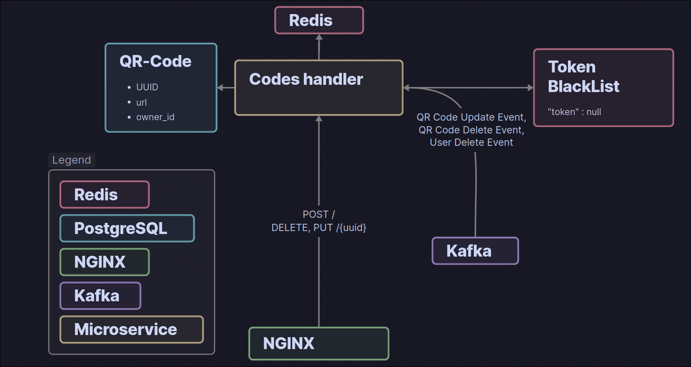
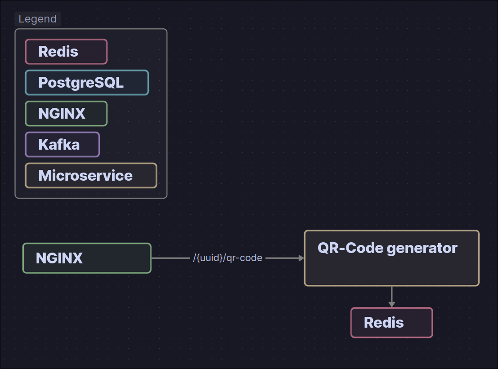

[**Documentation is also available in English!!!**](../README.md)

Это SaaS приложение позволяющее разместить публичную ссылку и получить QR Код, который можно в дальнейшем распечатать и не боятся, что он устареет, ведь то, куда он ведет, можно в любое время поменять!

# Микросервисы

`auth service` - создает JWT токены
`account service` - управляет данными учетных записей
`qr code handler` - управляет QR кодами
`redirect service` - занимается переадресацией пользователей
`qr code generator` - генерирует картинки QR кодов

# Методы API

## `/openapi.yaml`

### GET

Возвращает `openapi.yaml` файл с документацией к API.

#### Описание

При запросе NGINX сервер сразу возвращает файл `openapi.yaml`.

## `/register`

### POST

Позволяет зарегистрироваться пользователю на платформе.

#### Body

```json
{
"nickname": "string",
"password": "string"
}
```

#### Описание

NGINX перенаправляет запрос на микросервис `account service`, который в свою очередь создает новую запись в базе данных при этом хэшируя пароль пользователя.

## `/login`

### POST

При вводе данных об аккаунте возвращает JWT токен с временем жизни в час.

#### Body

```json
{
"password": "string",
"nickname": "string"
}
```

#### Описание

NGINX перенаправляет запрос на микросервис `auth service`. `auth service` делает gRPC запрос к `account service` и получает данные пользователя и хэш пароля. После чего `auth service` проверяет хэш и в случае успеха возвращает JWT токен с временем жизни в час.

## `/logout`

### POST

Требует авторизации. Добавляет JWT токен в черный список, чтобы его нельзя было использовать.

#### Описание

NGINX перенаправляет запрос на микросервис `auth service`.  После чего `auth service` добавляет JWT токен в Redis `jwt black list` на TTL равен времени жизни токена.

## `/account`

### GET

Требует авторизации. Выдает данные об аккаунте.

#### Описание

NGINX перенаправляет запрос на микросервис `account service`. `account service` аутентифицируя пользователя используя JWT токен берет данные из Redis и возвращает их. Если данных в Redis нет, он делает gRPC запрос к `qr code handler` и получает список всех кодов, которыми владеет пользователь соединяя их с данными из базы данных — при этом сохраняя в Redis на время — возвращает запрос пользователю.

### PUT

Требует авторизации. Обновляет данные пользователя. Можно обновить пароль и никнейм.

#### Body

```json
{
"nickname": "string",
"password": "string"
}
```

#### Описание

NGINX перенаправляет запрос на микросервис `account service`. `account service` обновляет данные в базе данных и кэше в Redis. После чего `account service` отправляет евент об изменении аккаунта в Kafka сразу же с новыми данными, чтобы микросервисы могли сразу изменить свои данные. На данный момент в приложении нет микросервисов, которые бы стали вести себя неправильно не узнав об обновлении данных об аккаунте, так как все основывается на неизменяемом id пользователя закодированном в JWT токене.

### DELETE

Требует авторизации. Удаляет все данные о пользователе.

#### Описание

NGINX перенаправляет запрос на микросервис `account service`, после чего он удаляет все данные из базы данных и Redis. Дальше `account service` отправляет евент в Kafka и его обрабатывают `qr code handler` и `redirect service`:

- `qr code handler`: удаляет все данные, с которыми связан пользователь
- `redirect service`: очищает свой кэш.

## `/`

### POST

Требует авторизации. Добавляет новую ссылку.

#### Описание

NGINX перенаправляет запрос на микросервис `qr code handler`, после чего он добавляет новую запись в базу данных.

## `/{UUID}`

### GET

Перенаправляет пользователя на адрес указанный автором ссылки.

#### Описание

NGINX перенаправляет запрос на микросервис `redirect service`. Он берет ссылку из Redis и перенаправляет по ней пользователя с кодом 303 (see other), чтобы избежать кэширования в браузере. Если ссылки в Redis нет, он делает gRPC запрос к `qr code handler` и получает ссылку, после чего сохраняет ее в Redis и перенаправляет пользователя с кодом 303 (see other).

### PUT

Требует авторизации. Обновляет ссылку, по которой совершается redirect.

#### Body

```json
{
"url": "string"
}
```

#### Описание

NGINX перенаправляет запрос на микросервис `qr code handler`, после чего он обновляет данные в базе данных и в Redis а также отправляет евент в Kafka для сервисов `redirect service`. `redirect service` в свою очередь очищает кэш в Redis для конкретного URL.

### DELETE

Требует авторизации Удаляет ссылку.

#### Описание

NGINX перенаправляет запрос на микросервис `qr code handler`, после чего он удаляет ссылку из базы данных а также из Redis при этом отправляя евент об удалении ссылки в Kafka. `redirect service` обрабатывает eвент и удаляет ссылку из своего кеша в Redis.

## `/{qr_code_uuid}/qr_code`

### GET

Генерирует QR код в виде изображения.

#### Описание

NGINX перенаправляет запрос на микросервис `qr code generator`, после чего он возвращает QR код из кэша или генерирует его и кэшиурет. `qr code generator` не связан никак с другими микросервисами а также не проверяет, существует ли ссылка и принадлежит ли она кому-то. Он просто проверяет id ссылки на соответствие формату UUID и генерирует QR код.

---

# QR Book


# Account service


# Auth service


# Qr code handler 



# Redirect service


# QR Code generator


